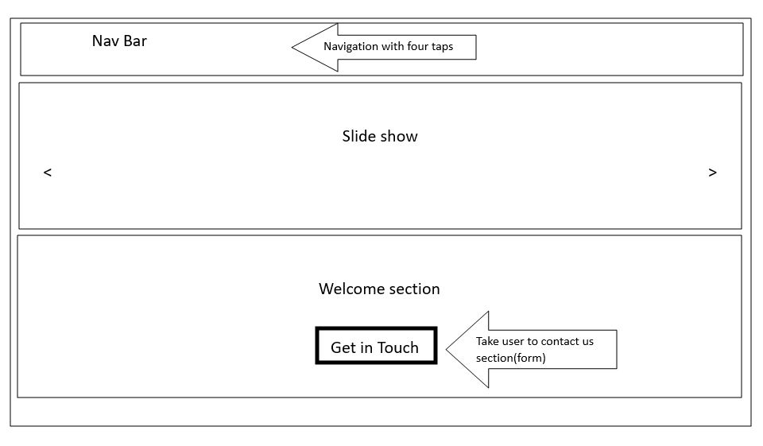

# DiversiHub

## Wireframe Layout & Responsive Design

### Desktop Layout

- Clean, modern navigation bar with logo and menu items
- Hero section with prominent call-to-action
- Grid-based content layout for featured items
- Footer with social links and additional navigation

- Section-based content organization
- Card-based UI elements for consistent visual hierarchy
- Whitespace utilized for improved readability

### Interactive Elements

- Dropdown menus for simplified navigation
- Modal windows for focused content
- Form elements with clear validation feedback

### Mobile & Tablet Responsive Strategy

#### Tablet Adaptations
- Navigation transforms into a more compact menu
- Grid layouts adjust to 2 columns
- Touch-friendly button sizes
- Adjusted spacing for optimal tablet viewing
- Sidebars collapse into sliding panels

#### Mobile Adaptations
- Single column layout for content
- Hamburger menu for navigation
- Stacked cards for better mobile scrolling
- Larger touch targets for better usability
- Simplified footer layout
- Full-width images and containers

### Responsive Design Implementation
- Use of CSS Grid and Flexbox for flexible layouts
- Mobile-first approach with progressive enhancement
- Breakpoints:
  - Mobile: < 768px
  - Tablet: 768px - 1024px
  - Desktop: > 1024px
- Key Features:
  - Fluid typography using rem units
  - Responsive images with appropriate sizing
  - Touch-friendly navigation
  - Optimized performance for all devices

